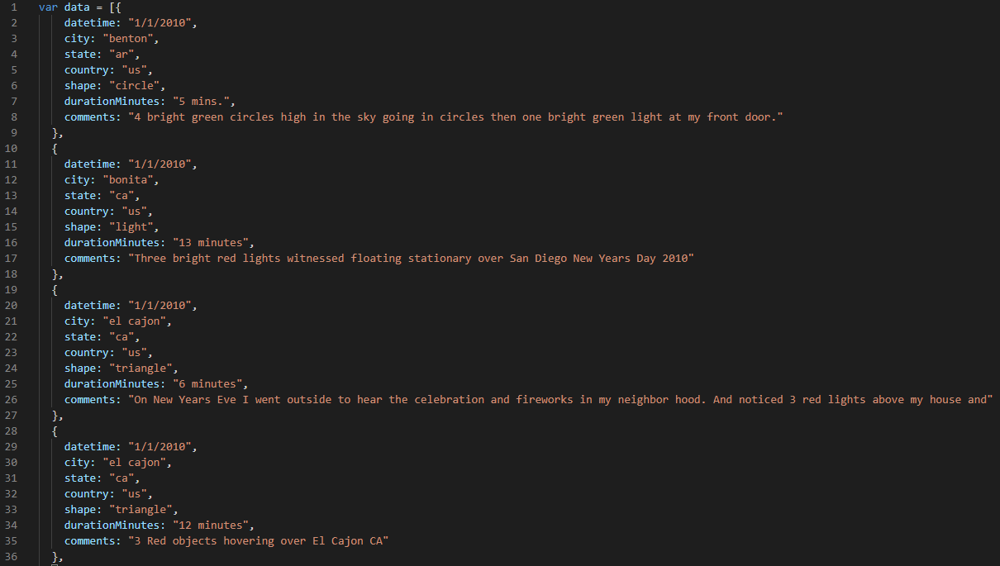
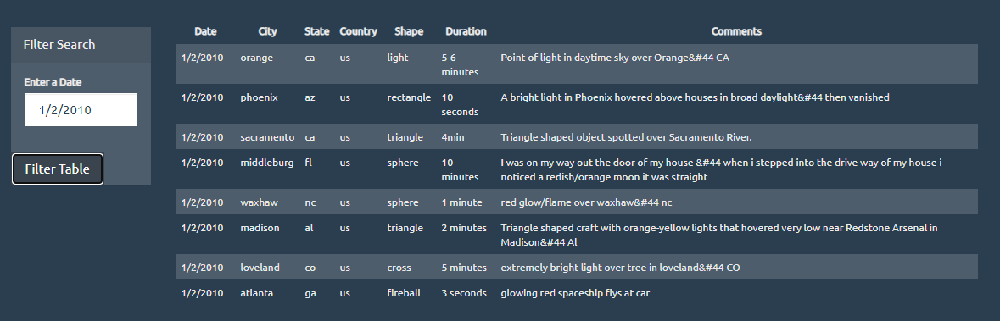

# javascript-challenge

Use the data of alien sighting in JSON and create a table via HTML with Javascript.

The goal is to make the table filterable using the d3(https://d3js.org/) Javascript library and event listeners.

Data:

Website:

